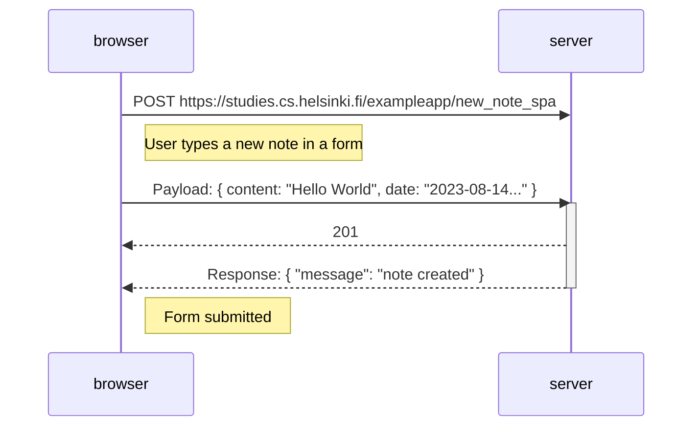

```mermaid
sequenceDiagram
    participant browser
    participant server

    browser->>server: POST https://studies.cs.helsinki.fi/exampleapp/new_note_spa
    Note right of browser: User types a new note in a form
    browser->>server: Payload: { content: "Hello World", date: "2023-08-14..." }
    activate server
    server-->>browser: 201
    server-->>browser: Response: { "message": "note created" }
    deactivate server
    Note right of browser: Form submitted

```